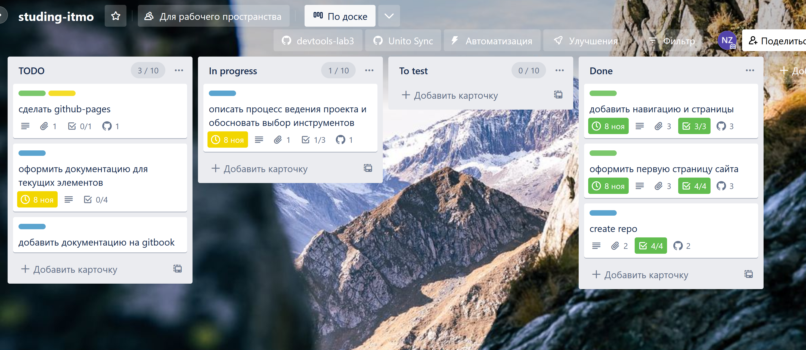

# Описание доски

### Столбцы доски

На доске размещены 4 основных столбца:

* TODO: список задач для выполнения
* In progress: текущие задачи
* To test: задачи на тестировании
* Done: завершенные задачи

В первых трех задачах установлен WIP: нельзя добавить более 10 задач одновременно.

<figure><figcaption>
Внешний вид доски
</figcaption></figure>

#### Автоматизация

Выполнена интеграция с репозиторием через улучшение в Trello. С его помощью можно добавить на карточки ветку, коммит, проблему, пул-реквест. Возможна еще полная интеграция для добавления задач или перемещения карточек, но это возможно только через платную подписку Unito.

На доске есть правила для автоматизации некоторых процессов:

* Переносить карточки в Done, если чек-листы выполнены
* Переносить карточки с меткой fix в столбец In progress
* Когда карточка в Done - отметить как выполненное по дедлайну
* Когда 10 и более карточек в столбцах с ограничениями, говорить, что пора работать :sob:

<figure><figcaption>
Правила для автоматизации
</figcaption></figure>

### Карточки

Карточки имеют метки: fix, feat, chore, deploy.

Дополнительно можно оставлять комментарии, чек-листы, краткое описание и прикрепленные сущности git.
